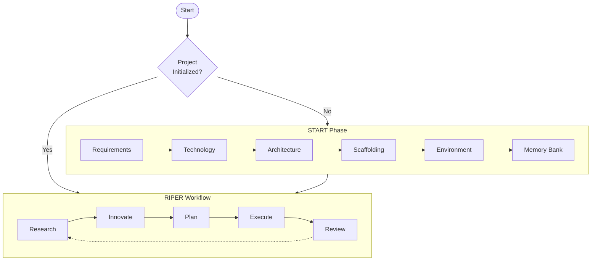

# CursorRIPER Framework

A comprehensive framework for AI-assisted software development in [Cursor IDE](https://www.cursor.com/) that combines structured workflow with persistent memory.  If you are worried about token count, then check out the streamline version [CursorRIPER.sigma](https://github.com/johnpeterman72/CursorRIPER.sigma)

## Overview

CursorRIPER provides a systematic approach to software development through five distinct operational modes:

1. **Research**: Information gathering and understanding existing code
2. **Innovate**: Brainstorming potential approaches and solutions
3. **Plan**: Creating detailed technical specifications
4. **Execute**: Implementing approved plans with precision
5. **Review**: Validating implementation against plans

This framework prevents unintended modifications while maintaining perfect continuity across coding sessions.



## Features

- **Structured Workflow**: Clear separation of development phases
- **Memory Bank**: Persistent documentation across sessions
- **Project Intelligence**: Learning from patterns and preferences
- **State Management**: Explicit tracking of project phase and mode
- **Safe Initialization**: Guided setup with protection against re-initialization
- **Enhanced Cursor Integration**: Shortcuts, commands, and IDE-specific features
- **Automatic Memory Hooks**: Context is updated automatically without manual intervention
- **Optimized Efficiency**: Standardized file extensions and improved command structure
- **Correction Learning System**: Auto-learns from corrections to prevent repeated mistakes

## Getting Started

1. Copy the framework files to your project and change the extension to .mdc:
   ```bash
   cp -r /path/to/CursorRIPER/src/.cursor/* .cursor/
   rename 's/\.md$/.mdc/' *.md
   ```

2. Initialize your project with:
   ```
   /start
   ```

3. Follow the START phase to set up your project structure and memory bank

4. Use the RIPER workflow for ongoing development with slash commands:
   ```
   /research
   /innovate
   /plan
   /execute
   /review
   ```

## Automatic Memory Hooks

The framework now features automatic memory hooks that track context and update memory bank files without manual intervention:

- **Mode Transition Hooks**: Update memory when switching modes
- **File Operation Hooks**: Track changes to project files
- **Command Hooks**: Update memory with specific commands
- **Session Hooks**: Maintain context across sessions
- **Correction Hooks**: Capture and learn from user corrections

Use special commands to control memory:
```
/focus Authentication
/checkpoint login-feature
/decision "Use JWT" "Better for stateless API"
/learn "What was wrong" "Correct approach" "Why it matters"
```

For detailed usage, see the [Memory Hooks Guide](docs/memory-hooks-guide.md).

## Cursor-Specific Features

The framework now includes special Cursor integration features:

- **Slash Commands**: Use `/command` format for efficient workflows
- **File References**: Reference files with `/file:path` syntax
- **Context Awareness**: Automatic integration with Cursor's editor state
- **Enhanced Search**: Improved code search capabilities
- **Visual Aids**: Better visualizations for plans and architecture
- **Memory Hooks**: Tighter integration with memory bank

For detailed usage, see the [Cursor Integration Guide](docs/cursor-integration-guide.md).

## Efficiency Optimizations

The framework has been optimized for efficiency:

- **Standardized Extensions**: All framework files use `.mdc` extension
- **Simplified Commands**: `/command` format is prioritized to avoid conflicts with Cursor's `@` helper
- **Automatic Context**: Less manual documentation needed
- **Lazy Loading**: Components are loaded only when needed
- **Content Compression**: Only relevant information is preserved

## Correction Learning System

The framework features an intelligent correction learning system that automatically captures and applies project-specific knowledge:

- **Auto-Learning**: Silently monitors code changes and user feedback to learn without disruption
- **Pattern Recognition**: Identifies recurring patterns in how you correct AI-generated code
- **Contextual Awareness**: Applies learnings only in appropriate contexts
- **Confidence Scoring**: Prioritizes high-confidence learnings for automatic application
- **Minimal Interaction**: Batches lower-confidence learnings for efficient review
- **Continuous Improvement**: Self-optimizes based on which auto-detected patterns are confirmed

Control the learning system with:
```
/learnings:auto on|off
/learnings:sensitivity high|medium|low
/learnings:digest
/learnings:approve
```

The system specializes in capturing knowledge that deviates from standard practices, ensuring the AI doesn't repeat the same mistakes across sessions.

For detailed usage, see the [Correction Learning Guide](docs/correction-learning-guide.md).

## Documentation

- [Setup Guide](docs/setup-guide.md)
- [START Phase Guide](docs/start-phase-guide.md)
- [RIPER Workflow Guide](docs/riper-workflow-guide.md)
- [Memory Bank Guide](docs/memory-bank-guide.md)
- [Memory Hooks Guide](docs/memory-hooks-guide.md)
- [Cursor Integration Guide](docs/cursor-integration-guide.md)
- [Custom Modes Guide](docs/custom-modes-guide.md)
- [Correction Learning Guide](docs/correction-learning-guide.md)
- [Troubleshooting Guide](docs/troubleshooting-guide.md)

## License

This project is licensed under the MIT License - see the LICENSE file for details.

---
The orginial RIPER framework is by: [robotlovehuman](https://github.com/robotlovehuman)

*The CursorRIPER Framework prevents coding disasters while maintaining perfect continuity across sessions.*
