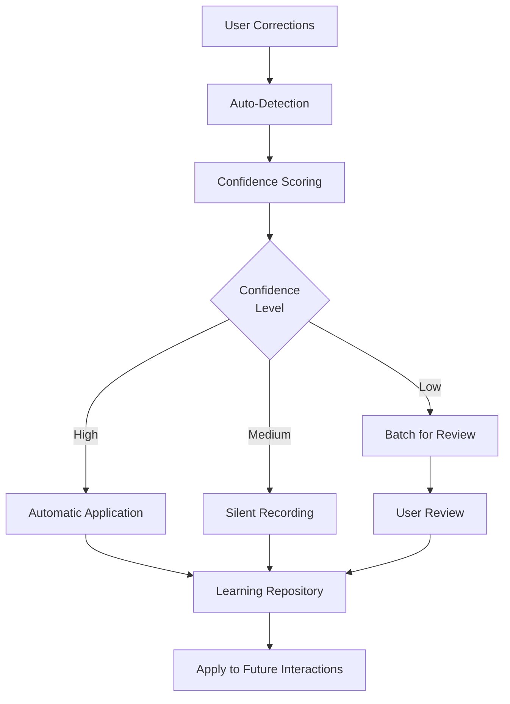

# CursorRIPER Framework - Correction Learning Guide

The Correction Learning System is an intelligent component of the CursorRIPER Framework that automatically captures and applies project-specific knowledge from user corrections. This guide explains how the system works and how to use it effectively.

## Correction Learning Overview



## What the System Learns

The Correction Learning System focuses on capturing knowledge that deviates from standard practices or expectations:

1. **Code Patterns**: Specific implementation approaches preferred in your project
2. **Workflow Rules**: How work should be structured or approached
3. **Project Preferences**: Conventions and style choices specific to your project
4. **Domain Knowledge**: Business logic or domain-specific requirements
5. **Technical Constraints**: Limitations or rules that must be followed

## Auto-Learning Capabilities

The system features autonomous learning with minimal user intervention:

### Detection Mechanisms

1. **Code Diff Analysis**:
   - Automatically compares AI-generated code with user-edited versions
   - Identifies patterns in changes (style, structure, naming conventions, logic)
   - Creates learning entries from recurring modifications

2. **Conversation Pattern Recognition**:
   - Identifies correction language without explicit commands
   - Recognizes expressions of preference or better practices
   - Detects when explanations contradict AI assumptions

3. **Workflow Monitoring**:
   - Observes when you consistently apply different patterns
   - Tracks approaches that differ from AI suggestions
   - Recognizes rejections of proposed solutions

### Confidence Scoring

Automatic learning entries are assigned confidence scores:

| Confidence | Trigger | Action |
|------------|---------|--------|
| High (0.8+) | Explicit correction, multiple occurrences | Auto-apply without confirmation |
| Medium (0.5-0.8) | Consistent pattern in edits | Apply with minimal notification |
| Low (0.3-0.5) | Potential pattern detected | Suggest learning with confirmation |

### Silent Learning Mode

The system minimizes interruptions to your workflow:

1. Records corrections without immediate confirmation
2. Summarizes learnings at the end of coding sessions
3. Provides simple accept/reject/modify options for detected learnings
4. Groups similar learnings for efficient review

## Using the Correction Learning System

### Explicit Correction Commands

You can explicitly record corrections using:

```
/learn "What was wrong" "The correct approach" "Why this matters"
```

OR

```
/correct "Incorrect assumption" "Correct understanding" "Context or reasoning"
```

### Natural Language Corrections

Simply correct the AI in natural language:

```
No, that's not correct. We always use async file operations in this project.
```

```
You've misunderstood our authentication flow. We use JWT tokens, not sessions.
```

### Control Commands

Manage the learning system with:

```
/learnings:auto on|off               # Toggle auto-learning
/learnings:sensitivity high|medium|low # Set sensitivity level
/learnings:digest                     # View current session learnings
/learnings:view [topic]              # View learnings by topic
/learnings:apply [component]         # Apply learnings to component
/learnings:clear [id]                # Remove a specific learning
/learnings:approve                   # Batch approve pending learnings
```

## Learning File Structure

Corrections are stored in a structured `learnings.md` file in the memory bank:

```markdown
## [Timestamp] - [Topic]

**Incorrect Assumption**:
[Description of what the AI got wrong]

**Correct Approach**:
[Description of the correct understanding or implementation]

**Context/Reasoning**:
[Why this is important and contextual factors]

**Code Pattern** (if applicable):
```[language]
[Code example showing correct pattern]
```

**Applies To**:
[List of file patterns, components, or scenarios where this learning applies]
```

## Best Practices

1. **Let Auto-Learning Work**: Trust the system to detect patterns rather than explicitly recording every correction
2. **Be Clear in Corrections**: When you do correct the AI, be specific about what was wrong and why
3. **Review Digests**: Periodically review the learning digests to confirm or refine auto-detected patterns
4. **Use Topic-Based Organization**: When viewing or managing learnings, use topics to keep things organized
5. **Adjust Sensitivity**: If the system is learning too much or too little, adjust the sensitivity level
6. **Prune Outdated Learnings**: Occasionally review and remove learnings that are no longer relevant
7. **Confirm High-Value Learnings**: Explicitly confirm learnings that are particularly important

## Configuration Options

Advanced users can configure the learning system by editing `.cursor/rules/learnings.mdc`:

```json
{
  "AUTO_LEARNING": {
    "ENABLED": true,
    "SENSITIVITY": "medium",
    "MIN_OCCURRENCES": 2,
    "SILENT_MODE": true,
    "DIGEST_FREQUENCY": "session-end",
    "LEARNING_THRESHOLD": 0.6,
    "CODE_PATTERN_DETECTION": true,
    "WORKFLOW_LEARNING": true,
    "MAX_SILENT_ENTRIES": 5,
    "BATCH_CONFIRMATION": true
  }
}
```

## Troubleshooting

If you encounter issues with the Correction Learning System:

1. **Too Many Learnings**: Lower sensitivity or increase MIN_OCCURRENCES
2. **Missing Important Patterns**: Increase sensitivity or explicitly record important learnings
3. **Incorrect Auto-Learnings**: Reject them in digests and provide clearer corrections
4. **System Not Learning**: Verify AUTO_LEARNING.ENABLED is true

For more help, refer to the [Troubleshooting Guide](troubleshooting-guide.md).

---

*The CursorRIPER Framework prevents coding disasters while maintaining perfect continuity across sessions.*
