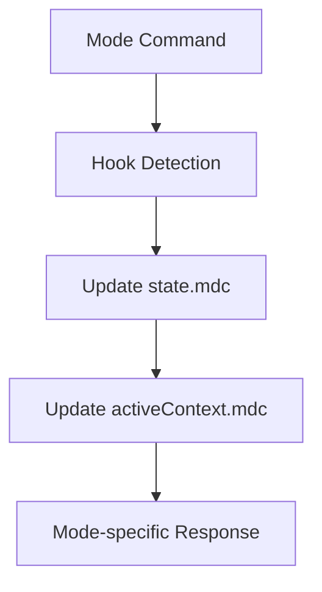

# CursorRIPER Framework - Memory Bank Hooks
# Version 1.0.1

## MEMORY HOOKS OVERVIEW

This file defines automatic hooks between Cursor IDE actions and the memory bank system, enabling automatic context updates without manual intervention.

## ACTIVATION HOOKS

Memory bank hooks are automatically activated when any of these events occur:

1. **Mode Transitions**: When switching between RIPER modes
2. **File Edits**: When files are modified through Cursor
3. **Command Execution**: When specific Cursor commands are used
4. **Focus Changes**: When the user changes their focus area
5. **Session Starts/Ends**: At the beginning and end of work sessions

## HOOK IMPLEMENTATION

### Mode Transition Hooks



| Mode | Memory Updates |
|------|---------------|
| RESEARCH | techContext.mdc, activeContext.mdc |
| INNOVATE | systemPatterns.mdc, activeContext.mdc |
| PLAN | activeContext.mdc, progress.mdc |
| EXECUTE | progress.mdc, activeContext.mdc |
| REVIEW | progress.mdc, activeContext.mdc, systemPatterns.mdc |

### File Operation Hooks

When files are edited, created, or deleted:

1. The change is detected automatically
2. Relevant sections of memory bank files are updated
3. Change context is preserved across sessions

### Contextual Commands

| Command | Memory Updates |
|---------|---------------|
| `/focus X` | Updates focus area in activeContext.mdc |
| `/checkpoint` | Creates save point in progress.mdc |
| `/decision X` | Records decision in systemPatterns.mdc |
| `/progress` | Updates status in progress.mdc |
| `/learn X` | Records correction learning in learnings.md |
| `/correct X` | Records correction learning in learnings.md |

### Correction Learning Hooks

When corrections are provided:

1. The correction is automatically detected and categorized
2. A structured entry is added to learnings.md
3. Relevant code patterns are extracted
4. Applicability scope is determined
5. Memory is updated for future interactions

### Auto-Learning Hooks

The auto-learning system continuously monitors:

1. **Code Modifications**: Diffs between AI-generated and user-edited code
2. **Interaction Patterns**: User responses and clarifications
3. **Recurring Approaches**: Consistent implementation styles
4. **Rejection Signals**: When suggestions are consistently declined

Learnings are processed based on confidence:
- High confidence → Automatic application
- Medium confidence → Silent recording with minimal notification
- Low confidence → Batched for later review

## AUTOMATIC CONTEXT TRACKING

The framework automatically tracks and updates:

1. **Current Focus**: What the user is currently working on
2. **Recent Changes**: Files that have been modified
3. **Open Files**: Currently open in the editor
4. **Cursor Position**: For contextual awareness

## MEMORY EFFICIENCY

To optimize memory usage:

1. Only relevant sections of memory files are updated
2. Context is compressed when appropriate
3. Historical information is prioritized by relevance
4. Cross-references are used instead of duplication

## SYSTEM INTEGRATION

### Cursor IDE Integration

Memory hooks integrate with Cursor through:

1. Monitoring file changes via Cursor's file system
2. Tracking command execution
3. Observing cursor position changes
4. Recording open files and editor state

### Hook Runtime

Memory hooks run:
1. Immediately after mode transitions
2. Shortly after file operations
3. On explicit memory commands
4. At session boundaries

## IMPLEMENTATION NOTES

1. All memory hooks are non-blocking
2. Updates occur asynchronously to maintain performance
3. Updates are atomic to prevent corruption
4. Conflict resolution prioritizes user-explicit changes

## USAGE

Hooks are automatically active. To manually trigger specific hooks:

```
/memory:update [file]
```

To view current memory state:

```
/memory:view [file]
```

To override automatic hooks:

```
/memory:pause
/memory:resume
```

To manage correction learnings:

```
/learnings:view [topic]         # View learnings by topic
/learnings:apply [component]    # Apply learnings to component
/learnings:clear [id]           # Remove a specific learning
/learnings:auto [on|off]        # Toggle auto-learning
/learnings:sensitivity [level]  # Set auto-learning sensitivity
/learnings:digest               # View current session learnings
/learnings:approve              # Batch approve pending learnings
```

---

*This file defines the automatic memory bank hooks for the CursorRIPER Framework.*
