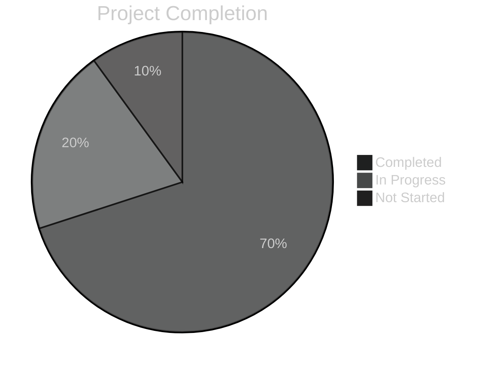

# Project Progress: [PROJECT_NAME]
*Version: 1.0.1*
*Created: [CURRENT_DATE]*
*Last Updated: [CURRENT_DATE]*
*Current Phase: [PROJECT_PHASE]*

## Overall Status
<!-- @status:auto-update -->
Current completion: [PERCENTAGE]%
<!-- @status:end -->

## What Works
<!-- @works:auto-update -->
- [COMPONENT_1]: Implemented and tested - [DETAILS]
- [COMPONENT_2]: Implemented but not tested - [DETAILS]
- [COMPONENT_3]: Partially implemented - [DETAILS]
<!-- @works:end -->

## In Progress
<!-- @in-progress:auto-update -->
- [TASK_1]: [STATUS] - [EST_COMPLETION]
- [TASK_2]: [STATUS] - [EST_COMPLETION]
- [TASK_3]: [STATUS] - [EST_COMPLETION]
<!-- @in-progress:end -->

## Pending Tasks
<!-- @pending:auto-update -->
- [ ] [TASK_4]: [PRIORITY] - [DESCRIPTION]
- [ ] [TASK_5]: [PRIORITY] - [DESCRIPTION]
- [ ] [TASK_6]: [PRIORITY] - [DESCRIPTION]
<!-- @pending:end -->

## Completed Tasks
<!-- @completed:auto-update -->
- [✓] [TASK_7]: Completed on [DATE] - [DESCRIPTION]
- [✓] [TASK_8]: Completed on [DATE] - [DESCRIPTION]
- [✓] [TASK_9]: Completed on [DATE] - [DESCRIPTION]
<!-- @completed:end -->

## Known Issues
<!-- @issues:auto-update -->
- [ISSUE_1]: [SEVERITY] - [DESCRIPTION] - [WORKAROUND]
- [ISSUE_2]: [SEVERITY] - [DESCRIPTION] - [WORKAROUND]
- [ISSUE_3]: [SEVERITY] - [DESCRIPTION] - [WORKAROUND]
<!-- @issues:end -->

## Recent Progress
<!-- @recent:auto-update -->
[DATE_1]:
- [PROGRESS_ITEM_1]
- [PROGRESS_ITEM_2]

[DATE_2]:
- [PROGRESS_ITEM_3]
- [PROGRESS_ITEM_4]
<!-- @recent:end -->

## Checkpoints
<!-- @checkpoints:auto-update -->
- [CHECKPOINT_1]: [DATE] - [DESCRIPTION]
- [CHECKPOINT_2]: [DATE] - [DESCRIPTION]
- [CHECKPOINT_3]: [DATE] - [DESCRIPTION]
<!-- @checkpoints:end -->

---

*This document tracks overall project progress and completion status.*

