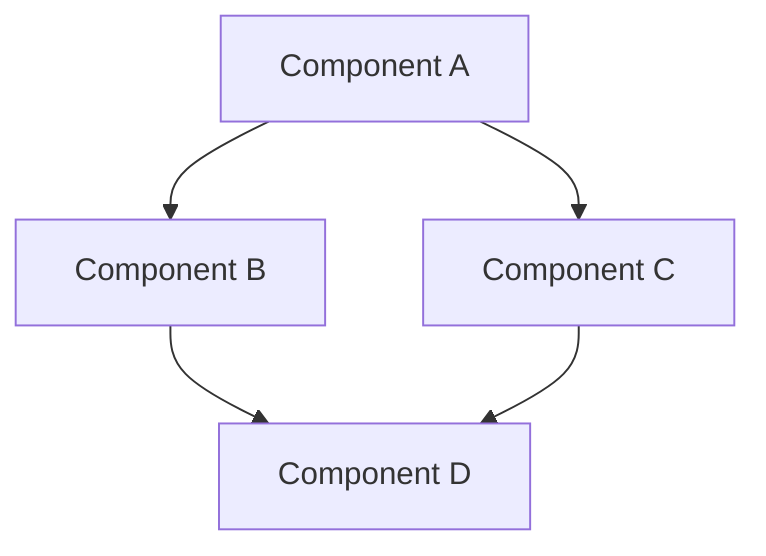
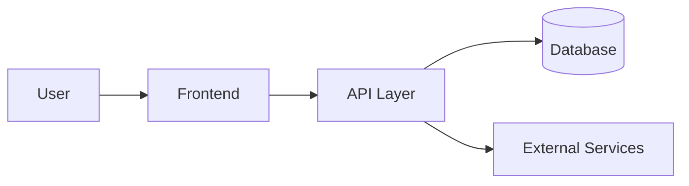

# System Patterns: [PROJECT_NAME]
*Version: 1.0.1*
*Created: [CURRENT_DATE]*
*Last Updated: [CURRENT_DATE]*
*Current RIPER Mode: [MODE_NAME]*

## System Architecture
<!-- @architecture:auto-update -->
[Description of the system architecture]
<!-- @architecture:end -->

## Key Design Decisions
<!-- @decisions:auto-update -->
- [DECISION_1]: [DATE] - [RATIONALE] - Relevance: [SCORE]
- [DECISION_2]: [DATE] - [RATIONALE] - Relevance: [SCORE]
- [DECISION_3]: [DATE] - [RATIONALE] - Relevance: [SCORE]
<!-- @decisions:end -->

## Code Patterns
<!-- @patterns:auto-update -->
- [PATTERN_1]: [DESCRIPTION] - [USAGE]
- [PATTERN_2]: [DESCRIPTION] - [USAGE]
- [PATTERN_3]: [DESCRIPTION] - [USAGE]
<!-- @patterns:end -->

## API Structure
<!-- @api:auto-update -->
- [ENDPOINT_1]: [METHOD] - [PURPOSE] - [AUTH]
- [ENDPOINT_2]: [METHOD] - [PURPOSE] - [AUTH]
- [ENDPOINT_3]: [METHOD] - [PURPOSE] - [AUTH]
<!-- @api:end -->

## Data Models
<!-- @models:auto-update -->
- [MODEL_1]: [FIELDS] - [RELATIONSHIPS]
- [MODEL_2]: [FIELDS] - [RELATIONSHIPS]
- [MODEL_3]: [FIELDS] - [RELATIONSHIPS]
<!-- @models:end -->

## Integration Points
<!-- @integrations:auto-update -->
- [INTEGRATION_1]: [DESCRIPTION] - [INTERFACE]
- [INTEGRATION_2]: [DESCRIPTION] - [INTERFACE]
- [INTEGRATION_3]: [DESCRIPTION] - [INTERFACE]
<!-- @integrations:end -->

## Technical Debt
<!-- @debt:auto-update -->
- [DEBT_1]: [IMPACT] - [MITIGATION]
- [DEBT_2]: [IMPACT] - [MITIGATION]
- [DEBT_3]: [IMPACT] - [MITIGATION]
<!-- @debt:end -->

## Observed User Preferences
<!-- @preferences:auto-update -->
- [PREFERENCE_1]: [DESCRIPTION] - [OBSERVATION]
- [PREFERENCE_2]: [DESCRIPTION] - [OBSERVATION]
- [PREFERENCE_3]: [DESCRIPTION] - [OBSERVATION]
<!-- @preferences:end -->

---

*This document captures system architecture and key technical decisions.*

## Key Components
- [COMPONENT_1]: [PURPOSE]
- [COMPONENT_2]: [PURPOSE]
- [COMPONENT_3]: [PURPOSE]

## Design Patterns in Use
- [PATTERN_1]: [USAGE_CONTEXT]
- [PATTERN_2]: [USAGE_CONTEXT]
- [PATTERN_3]: [USAGE_CONTEXT]

## Data Flow
[Description or diagram of how data flows through the system]

## Component Relationships
[Description of how components interact with each other]
